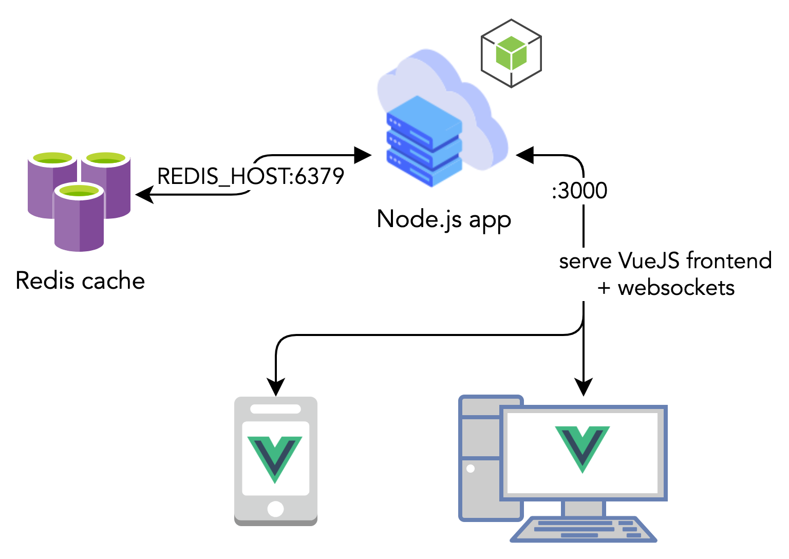

**DISCLAIMER: bad quality code, this project has mainly been developed in one night "hackthon-like" mode, for a one-time usage purpose**

# Bluffer - Remote app


## Abstract
In these times of lockdown, it is critical to stay in touch with our friends and family. What's better for that than a great board game? Unfortunately, some of these games can merely be played remotely. We could hijack our traditional messaging apps. But wouldn't it be funnier to focus on the game?     
The [Bluffer](https://www.trictrac.net/jeu-de-societe/bluffer) is, for us, one of the most user-friendly and fun games to play. However, it's also one of the hardest to virtualize without specific tools.    
Do you have a Bluffer at home? Clone this repository which provides client and server under open source license, launch your favorite video chat application with your friends or family and start playing!

## Getting started (developer)
Be sure to read the [License](./LICENSE) file before getting started.



> Tip: you can use vscode provided devcontainer to get started quicker.

### Backend

```sh
npm install
cd server
node index.js
```

You can access your NodeJS server on the port `3000` of your localhost.

### Frontend

```sh
npm install
cd src
npm run serve
```

You can access your VueJS development frontend on the port `8080` of your localhost.

### Run
#### Using Docker
```sh
docker run $(docker build . -q) -e REDIS_HOST=localhost
```
> note: you need a redis cache exposed on default port

#### Using Docker-Compose
```sh
docker-compose up -d
```

#### Manual
```sh
npm install
npm run build
export REDIS_HOST=localhost
node server/index.js
```
> note: you need a redis cache exposed on default port

## How to play?

To play this game you need at least 3 players, but the more you are the funnier it is (although you should set a limit at 7-10 players).

Please refer to the official rules. We will only detail how to use our app.

### Master
The one to create the game will then be the Master of the game.

1. Fill-in your first name
2. Click on "Create a new game"
3. You can now share the 6-digits code at the top-left of the screen with your beloved ones (or the link provided if you click on that very number)
4. Write down the first question in the box
5. Click on "Ouvrir les réponses"
6. Wait for everyone to send his fake answer (a green dot appear next to each player avatar once they have sent their answer)
7. Answers will appear on your screen **do not refresh**. You can edit their answers to group identical ones or to make them more likely/similars
8. Write down the right answer in the dedicated box
9. Click on "Ouvrir le vote"
10. Wait for everyone to vote (a green dot appear next to each player avatar once they have voted)
11. Click on "Fermer le vote"
12. Scores are automatically updated
13. You can start a new question by clicking on "Nouvelle question". Start again from step (4).

### Player
1. Fill-in your first name
2. Click "Rejoindre une partie"
3. Insert the game code your friend sent you
4. Click "Rejoindre une partie"
5. Wait for the first question to be displayed
6. Write down your fake answer in the dedicated box. You can still update it later until the Master has closed this step of the game. **do not refresh the page**.
7. If the Master updates your answer you will see a new box where you can accept the changes or edit them. It is usually to merge similar answers or to make yours more likely.
8. You can then proceed to vote for the answer you think is true **do not Google it!**. To acknowledge your vote, you'll see your avatar appear on the button of the answer you selected.
9. The game Master closes the votes. You can now see your points, who wrote which answer and others votes.
